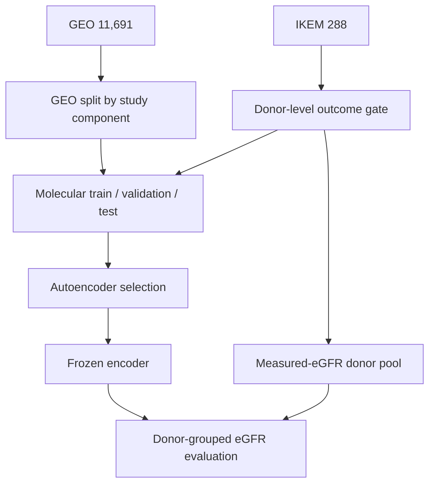

# ARCHCON project context and engineering handover

**Updated:** 2026-09-16  
**Packaged Python application:** ArchCon 0.5.16.post6 source patch; MetaCentrum uses an installed wheel plus separate scripts/data  
**Active work:** finalizing donor-safe CEL/RMA installation, running final-paper neural sweeps, and preparing checkpoint-free eGFR baselines  
**Current MetaCentrum project root:** `/storage/brno2/home/anuarali/DP/ARCHCON`

This document is the project-wide handover for continuing ARCHCON in a fresh conversation. It describes the research purpose, code layout, data contracts, experimental protocol, cluster workflow, known problems, and the exact state of the current repair. It is context, not a substitute for inspecting the current source files before editing.

---

## 1. Research purpose

ARCHCON is a Python/Gradio research application and batch-training toolkit developed around Kyrylo Stadniuk's 2026 CTU FEE diploma thesis, *Modern Alternatives to Archetypal Analysis of Gene Expression Data*.

The intended scientific pipeline has three conceptually separate stages:

1. **Generic molecular representation learning**
   - pretrain an autoencoder on a large public Affymetrix PrimeView GEO collection;
   - optionally include outcome-blind IKEM biopsies whose entire donor has no measured eGFR;
   - use reconstruction objectives only, without kidney-specific archetypal or eGFR supervision.
2. **Kidney-specific representation/archetypal modelling**
   - transfer the encoder to the IKEM kidney-biopsy cohort;
   - study archetypal representations and clinical side information.
3. **Longitudinal eGFR evaluation**
   - freeze representation/model-selection choices before outcome evaluation;
   - evaluate with donor-grouped cross-validation and appropriate clinical/molecular baselines.

The project must keep these stages separate. In particular, eGFR-bearing biopsies must not influence molecular preprocessing references, representation training, or unsupervised hyperparameter selection.

---

## 2. Three different notions of “current”

Several versions coexist and must not be conflated.

| State | Meaning | Status |
|---|---|---|
| Historical 900-run sweep | Earlier three-arm experiment, including Stadniuk range rescaling | Exploratory; checkpoints are not final-paper compatible |
| ArchCon 0.5.16.post6 | Current source contract, including donor-safe molecular validation and checkpoint-free AIC/BIC baselines | Main code base; user builds and installs the wheel |
| Donor-safe CEL/RMA rebuild | Exact private-CEL preprocessing, donor-level eGFR exclusion, and fixed IKEM 80/20 train/validation split | Numerical work complete; final candidate installation repair pending one short resume |

Any new work should state which of these it changes. Do not call an old checkpoint “current” merely because it is readable.

---

## 3. Canonical data facts

### 3.1 GEO pretraining collection

The currently validated RMA collection contains:

| Quantity | Value |
|---|---:|
| Unique GEO samples | 11,691 |
| Common PrimeView probes | 42,917 |
| GSEs with paired raw/per-GSE products | 464 |
| Frozen train samples | 10,522 |
| Frozen validation samples | 585 |
| Frozen test samples | 584 |

The split source currently used by the rebuild is:

```text
/storage/brno2/home/anuarali/DP/ARCHCON/sweeps/archcon-pretrain-0515/prepared/sample_index.csv
```

GEO is split by whole connected source-GSE components. No GSE may span train, validation, and test. The preprocessing code must assert this.

An older reconstruction handover mentioned 508 source GSEs and 12,563 GSE–GSM memberships. That described the broader source-membership inventory before the current final paired-dataset filter. The current RMA run's authoritative count is 464 GSEs and 11,691 unique physical arrays.

A GSM can belong to multiple GEO Series through SuperSeries/SubSeries relationships. Aggregate matrices contain each physical GSM once; occurrence tables may legitimately contain repeated `(GSE, GSM)` memberships.

### 3.2 IKEM kidney-biopsy collection

Canonical IKEM metadata are defined by:

```text
data/sample_metadata.csv
```

Current cohort:

| Quantity | Value |
|---|---:|
| Biopsies | 288 |
| Donors | 181 |
| Public GSE290167 biopsies | 276 |
| Public GSE290167 donors | 174 |
| Common GEO-compatible probes | 42,917 |

The historical supervised matrix may contain 42,921 post-QC probes. Alignment to GEO must always be performed by probe ID; never truncate four columns or assume positional equality.

### 3.3 Private versus public CEL coverage

The private Stadniuk CEL collection is canonical and primary:

```text
data/IKEM_CEL/STADNIUK_LEGACY_CEL/
```

It contains 288 CEL files. Public GSE290167 is fallback-only for a canonical biopsy missing privately. A sample must never appear twice.

The filename parser must normalize variations such as:

```text
D163_L__(PrimeView).CEL
D164_L__(PrimeView).CEL
D205_p_(PrimeView).CEL
```

The source mismatch that motivated the private-CEL repair was:

| Source | Biopsies |
|---|---:|
| `sample_metadata.csv` | 288 |
| Historical IKEM NumPy store | apparently 286 |
| Public GSE290167 | 276 |
| Historical/public overlap | 274 |

The 12 private-only biopsies are:

```text
D074_L D074_P D076_L D076_P D081_L D081_P
D098_L D098_P D109_L D109_P D145_L D204_L
```

The public biopsies absent from the historical store are `D163_L` and `D164_L`.

---

## 4. Final target split and leakage contract

The eGFR table is:

```text
data/egfr_data.xlsx
```

Availability is determined from:

```text
egfr_7d, egfr_3m, egfr_6m, egfr_12m
```

A biopsy is treated as outcome-bearing when any of these fields contains a finite value. A partially observed longitudinal trajectory is therefore outcome-bearing.

### 4.1 Donor-level outcome gate

Observed biopsy counts are:

| Role before donor correction | Biopsies |
|---|---:|
| At least one measured eGFR value | 254 |
| No measured eGFR value | 34 |

Four apparently outcome-free biopsies belong to donors whose other biopsy has measured eGFR:

```text
D006_L
D037_P
D106_P
D118_L
```

These four must be labelled `held_out_related_to_measured_egfr`. They are excluded from molecular train/validation and do not themselves enter the eGFR outcome analysis because they have no outcome.

After this correction, 30 biopsies from 18 donors are eligible for outcome-blind pretraining.

### 4.2 Frozen IKEM pretraining split

The final target policy is a donor-level, tissue-pattern-stratified 80/20 train/validation split, with no IKEM molecular test partition.

```text
seed = 20260915
validation fraction = 0.20
split unit = donor
strata = available biopsy pattern L, P, or LP
```

Expected membership:

| IKEM role | Biopsies | Donors |
|---|---:|---:|
| Pretraining train | 24 | 14 |
| Pretraining validation | 6 | 4 |
| Related no-eGFR held out | 4 | part of outcome-bearing donor set |
| Measured-eGFR evaluation | 254 | 163 |
| Total | 288 | 181 |

Validation donors:

```text
D076 D097 D184 D204
```

Validation biopsies:

```text
D076_L D076_P D097_L D097_P D184_P D204_L
```

Training donors:

```text
D007 D010 D019 D020 D040 D058 D073
D074 D081 D090 D098 D105 D109 D145
```

Every biopsy from one donor must remain in one logical role. The code must assert pairwise-disjoint train, validation, and outcome-held-out donor sets.

### 4.3 Final molecular partitions

When GEO and eligible IKEM rows are combined:

| Partition | GEO | IKEM | Total |
|---|---:|---:|---:|
| Molecular train | 10,522 | 24 | 10,546 |
| Molecular validation | 585 | 6 | 591 |
| Molecular test | 584 | 0 | 584 |
| Later measured-eGFR evaluation | 0 | 254 | 254 |

Outcome availability is used to define the cohort gate, but numeric eGFR values must never enter preprocessing or representation model selection. This missingness-based selection must be disclosed as a study-design caveat.



---

## 5. Molecular preprocessing arms

The data stores and the training comparison use related but not identical terminology.

### 5.1 Stored CEL-derived matrices

The reconstructed stores contain:

- `raw_original.npy`
- `rma_per_gse.npy`
- `rma_global.npy`

`raw_original` is not a CEL file. It is the per-probe-set median of original PM intensities for the common probes, before RMA background correction/quantile normalization/summarization.

### 5.2 Current final-paper training arms

1. **Per-dataset standardization**
   - starts from the raw/original representation;
   - fits per-probe center/scale parameters within permitted training data;
   - replaces the older Stadniuk range-rescaling comparison arm.
2. **Per-study RMA**
   - each GEO study is normalized as a study;
   - an entire GSE stays in one molecular split;
   - therefore no train-to-validation/test leakage occurs, but normalization remains transductive among samples within a held-out study.
3. **Global RMA / frozen global reference**
   - fit a common target and probe effects from permitted molecular-training arrays only;
   - apply frozen parameters independently to validation, test, and eGFR-held-out arrays.

### 5.3 Exact CEL-level publication target

For the post-0.5.15 exact rebuild:

- IKEM-local `rma_per_gse` parameters are fitted using only the 24 IKEM pretraining-train biopsies.
- The combined global reference is fitted using exactly `10,522 GEO train + 24 IKEM train = 10,546 arrays`.
- Six IKEM validation biopsies, four related held-out biopsies, 254 eGFR biopsies, GEO validation, and GEO test are transform-only.

If the IKEM training membership changes, the combined global target changes. All matrices mathematically dependent on that target must be rebuilt, including the GEO `rma_global` output. Existing CEL downloads, per-GSE RMA products, raw matrices, and compatible background-correction caches should be reused.

### 5.4 Python-only fallback global normalizer

`src/archcon/rebuild_global_normalization.py` fits a train-only quantile target from already summarized `raw_original.npy`. It is a useful leakage-safe fallback, but it is not exact CEL/probe-level RMA and must not be described as such.

For the paper pipeline, the exact R/CEL rebuild is authoritative when available.

---

## 6. Repository structure

The main Python project is conventionally laid out as follows:

```text
ARCHCON/
├── pyproject.toml
├── README.md
├── METACENTRUM.md
├── LICENSE
├── src/archcon/
│   ├── __init__.py
│   ├── __main__.py
│   ├── _compat.py
│   ├── app.py
│   ├── cli.py
│   ├── batch.py
│   ├── evaluate_egfr.py
│   ├── rebuild_global_normalization.py
│   ├── assets/
│   │   ├── molecular_mixed_models.R
│   │   ├── rma_preprocess.R
│   │   ├── scratch_run_array.pbs.sh.in
│   │   └── scratch_submit.sh.in
│   └── data/
│       ├── defaults.py
│       ├── loading.py
│       ├── geo.py
│       ├── geo_rma.py
│       ├── cel.py
│       ├── qc.py
│       ├── supervised.py
│       ├── pretraining.py
│       ├── training_sources.py
│       ├── ikem_preprocessing.py
│       ├── training.py
│       ├── downstream.py
│       └── archetypal_design.py
├── scripts/
│   ├── evaluate_molecular_egfr.py
│   ├── rebuild_geo_rma.R
│   ├── rebuild_geo_rma.pbs.sh
│   ├── verify_wheel.py
│   ├── geo_rma_stages/
│   │   ├── 01_download.R
│   │   ├── 02_per_gse_rma.R
│   │   └── 03_train_reference_rma.R
│   └── metacentrum/
│       ├── run_array.pbs.sh
│       ├── submit.sh
│       ├── run_saved_egfr_mixed_models.R
│       └── run_saved_egfr_mixed_models.pbs.sh
└── tests/
    ├── test_app.py
    ├── test_batch.py
    ├── test_cel_backend.py
    ├── test_data_defaults.py
    ├── test_data_loading.py
    ├── test_downstream.py
    ├── test_geo_rma.py
    ├── test_global_normalization.py
    ├── test_ikem_preprocessing.py
    ├── test_pretraining.py
    ├── test_training.py
    └── test_training_sources.py
```

The latest cluster-only CEL/RMA hotfix has also been distributed as four flat source files:

```text
scripts/metacentrum_geo_train_reference_rma.R
scripts/metacentrum_ikem_cel.R
scripts/metacentrum_rebuild_geo_rma.R
scripts/metacentrum_rebuild_geo_rma.pbs.sh
```

These flat files are newer than the packaged RMA scripts in some source archives. Once the repair is stable, their logic should be synchronized back into the canonical package structure rather than maintained indefinitely as an undocumented fork.

---

## 7. Main Python modules

| File | Responsibility |
|---|---|
| `app.py` | Gradio application, seven-stage workflow, guarded asynchronous UI updates |
| `cli.py` | `archcon` entry point; browser mode or one exported headless run |
| `batch.py` | Run-config serialization, sweep-grid expansion, readable job generation, PBS bundle export |
| `evaluate_egfr.py` | Checkpoint selection, embedding extraction, mixed-model/eGFR orchestration |
| `rebuild_global_normalization.py` | Python train-reference quantile-normalization fallback from probe-set summaries |
| `data/defaults.py` | Data-directory discovery and canonical path layout; prefers `IKEM_CEL_NUMPY_STORE` over legacy IKEM store |
| `data/loading.py` | CSV/Excel/Parquet loading, sample-ID canonicalization, orientation normalization to samples × probes |
| `data/geo.py` | Memory-bounded inspection of the historical large GEO Parquet file |
| `data/geo_rma.py` | Memory-mapped reconstructed GEO store, GSE/GSM indexes, representation selection |
| `data/cel.py` | Optional local R/affy CEL-to-RMA bridge |
| `data/qc.py` | Histograms, PCA, missingness, cohort comparison, and eGFR trajectory diagnostics |
| `data/supervised.py` | eGFR-availability classification, donor IDs, donor-safe outcome gate, deterministic IKEM split |
| `data/pretraining.py` | Architecture definitions/presets, connected-GSE split, diagrams and loss names |
| `data/training_sources.py` | Method-matched GEO/IKEM sources, probe alignment, frozen prepared assets and split validation |
| `data/ikem_preprocessing.py` | Method-matched downstream IKEM transformations and provenance |
| `data/training.py` | PyTorch models, objectives, streaming minibatches, validation, metrics and checkpoints |
| `data/downstream.py` | Checkpoint scanning, frozen embeddings, repeated donor folds, fold-local transforms and R/lme4 bridge |
| `data/archetypal_design.py` | Design-only post-pretraining AA alternatives; no final AA training loop yet |

Important design rule: generated batch jobs consume frozen row/column arrays. They must not reclassify outcomes, realign probes, or recompute a split independently.

---

## 8. Web application workflow

The current UI is organized as:

```text
01 Unsupervised data
02 Supervised data
03 Preprocessing
04 Matrix
05 Split
06 Molecular AE
07 Downstream / future AA
```

The browser remains responsive during expensive plots. Plot jobs use guarded background execution so repeated clicking cannot build an unbounded PCA/histogram queue. Do not regress the UI to a full-page blocking spinner.

Internally, all expression matrices use:

```text
rows = samples
columns = probes/features
```

---

## 9. Autoencoder families and objectives

The main paper comparison currently focuses on two interpretable families:

### Stadniuk MLP

- dense symmetric autoencoder;
- baseline hidden widths `256 → 64`;
- ReLU;
- linear latent code;
- faithful final form has no BatchNorm;
- historical/experimental grid also tests BatchNorm;
- dropout 0.1 and 0 are both represented in the expanded grid;
- explicit L2 values include `0`, `1e-5`, and `1e-4`.

### ResNet-LN

- dense MLP with width-changing projections;
- same-width pre-LayerNorm residual FFN blocks after each projection;
- configurable one/two residual blocks and 2×/4× FFN expansion;
- diagrams must show the actual identity bypass and `+` merge.

Current objective implementations include MSE, masked MSE, Huber, MSE+cosine, β-VAE/DVIB, and WAE/MMD variants. The comparison grid currently retains MSE and masked MSE. Do not replace microarray reconstruction with RNA-seq count likelihoods such as NB/ZINB without a coherent new observation model.

---

## 10. Historical 900-run grid versus the expanded recommended grid

### Historical 900-run sweep

For each of three preprocessing arms:

- 180 Stadniuk-MLP configurations;
- 120 ResNet-LN configurations;
- 300 per preprocessing;
- 900 total.

This is the sweep associated with much of the preliminary checkpoint/eGFR work. It used the older preprocessing and sample-membership contract.

### Expanded recommended grid introduced in 0.5.15

For each of three preprocessing arms:

- 360 Stadniuk configurations: the original 180 at dropout 0.1 plus 180 at dropout 0;
- 120 ResNet-LN configurations;
- 480 per preprocessing;
- 1,440 total.

Stadniuk grid dimensions:

```text
five hidden-width profiles
latent dimension 3 / 8 / 16
MSE / masked MSE
explicit L2 0 / 1e-5 / 1e-4
BatchNorm off / on
dropout 0.1 / 0
```

ResNet-LN grid dimensions:

```text
five hidden-width profiles
latent dimension 3 / 8 / 16
MSE / masked MSE
one / two residual blocks per stage
2x / 4x FFN expansion
```

The final donor-safe preprocessing change requires a new versioned sweep root. Do not overwrite the old sweep or mix checkpoints from different data contracts.

---

## 11. Frozen sweep bundle

A generated sweep contains approximately:

```text
sweeps/<name>/
├── jobs/run_0001.py ...
├── configs/run_0001.json ...
├── manifest.csv
├── split.csv
├── run_array.pbs.sh
├── submit.sh
├── prepared/
│   ├── prepared.json
│   ├── sample_index.csv
│   ├── probe_index.csv
│   ├── train_rows.npy
│   ├── validation_rows.npy
│   ├── test_rows.npy
│   ├── supervised_no_egfr_common.npy
│   ├── geo_rows_<method>.npy
│   ├── geo_columns_<method>.npy
│   └── standardization/reference metadata
└── results/run_XXXX/
    ├── latest.pt
    ├── best.pt
    ├── stopped.pt            # optional
    ├── run_summary.json
    └── small provenance/log files
```

In the final protocol, `prepared/sample_index.csv` must record the authoritative CEL-derived IKEM donor split. A historical store may be supported for exploration, but the paper run must refuse a fallback-generated split without the required provenance.

---

## 12. Training backend and checkpoint rules

Training uses PyTorch with memory-mapped NumPy matrices, streamed batches, optional background prefetch, CUDA pinned transfer, mixed precision, optional `torch.compile`, and configurable validation/PCA cadence.

Checkpoint roles:

- `latest.pt`: most recent complete epoch;
- `best.pt`: best permitted molecular-validation checkpoint;
- `stopped.pt`: optional recovery checkpoint after cooperative stop.

A true resume must verify:

- preprocessing identity and provenance;
- exact train/validation row arrays;
- canonical probe order;
- compatible architecture, optimizer, and scheduler state.

Weights-only initialization can start a new experiment, but it is not a resume of an old data contract.

---

## 13. Hyperparameter selection and molecular test policy

The target paper policy is:

1. train on GEO train + 24 IKEM train biopsies;
2. choose hyperparameters using molecular validation only;
3. ensure the six IKEM validation biopsies materially participate;
4. report GEO and IKEM validation metrics separately;
5. aggregate IKEM validation donor-wise so an LP donor is not automatically double-weighted;
6. evaluate the 584 GEO test rows only after the choice is frozen;
7. never use eGFR CV performance to choose the unsupervised encoder.

Historical versions of `evaluate_egfr.py`/`downstream.py` selected
preprocessing×architecture winners from pooled molecular validation+test MSE.
That exploratory policy is obsolete. The 0.5.16 contract validates the
checkpoint-embedded 50/50 GEO/IKEM validation score and evaluates GEO test only
after the winners are frozen.

Because the IKEM validation subset has only six biopsies from four donors, its uncertainty must be reported. If a composite GEO+IKEM score is used, its weighting must be declared before inspecting test or eGFR outcomes.

---

## 14. Downstream eGFR evaluation

The intended downstream sequence is:

1. select/freeze the encoder without eGFR;
2. prepare method-matched IKEM matrices;
3. extract latent `z` for the measured-eGFR biopsies;
4. reshape the four time points to longitudinal form;
5. perform repeated donor-grouped cross-validation;
6. fit every supervised transform only inside the training fold;
7. compare molecular, PCA, time, and clinical models.

Baselines already represented in the code include:

- time only;
- PCA(3), fitted inside each training fold;
- winner `z`;
- alternative architecture `z`;
- KDRI;
- donor age;
- cold ischemia;
- combined clinical baseline;
- clinical + winner `z`;
- clinical + PCA.

Clinical median imputation and scaling, latent scaling, PCA, feature selection, and mixed-model fitting must be fold-local. Donors, not biopsies or time rows, are the CV grouping unit.

The R backend uses `lme4`. Categorical time is a fixed effect and patient/recipient is used as a random intercept where supported by the design.

---

## 15. Preliminary exploratory results

These results are useful diagnostics but are not final evidence because the preprocessing/split contract later changed.

- Among the first few readable checkpoints, `run_0002` (Stadniuk rescaling · Stadniuk MLP · latent 3) was the preliminary winner.
- Example pooled molecular MSE: approximately `0.050283` (`VAL ≈ 0.04943`, `TEST ≈ 0.05113`).
- Example molecular-only repeated-CV RMSE:
  - time only: `0.347131`;
  - PCA(3): `0.345796`;
  - winner `z`: `0.347495`.
- In that exploratory run, winner `z` did not improve over the time/PCA baselines on average.

Do not carry these numbers into the final paper without rerunning the final donor-safe protocol.

---

## 16. Exact CEL/RMA rebuild architecture

The current cluster rebuild is resumable and roughly follows:

1. Validate/download GEO CEL sources.
2. Reuse or compute per-GSE RMA checkpoints.
3. Validate and aggregate existing raw/per-GSE matrices into working HDF5.
4. Build the PrimeView PM-cell template.
5. Prepare private IKEM CELs and assign donor-safe roles.
6. Fit IKEM-local RMA from the 24 IKEM train biopsies.
7. Build the combined global target/reference from 10,522 GEO + 24 IKEM train arrays.
8. Apply frozen parameters to all GEO/IKEM rows.
9. Validate finite matrices, indexes, signatures, and provenance.
10. Atomically install final NumPy/CSV outputs.

PrimeView details already established:

| Quantity | Value |
|---|---:|
| Template sample | GSM872430 / GSE35663 |
| Repeated PM-cell memberships | 30,483 |
| PM memberships in full global target | 550,697 |
| Common-probe PM memberships in working HDF5 | 470,150 |

Repeated PM-cell membership across probe sets must be preserved, not deduplicated.

Expected IKEM matrices are finite C-order `float32` arrays of shape `288 × 42,917`.

---

## 17. Current RMA repair state

Completed and reusable:

- all 464 GEO per-GSE RMA checkpoints;
- validation of the 464 paired datasets;
- GEO raw/per-GSE aggregation logic;
- private 288-CEL discovery;
- public-fallback correspondence logic;
- historical probe comparison changed from literal-order equality to ID-based audit;
- reference-contract/signature machinery for selective invalidation.

Previously observed safe failure:

```text
IKEM CEL sources: 288 private; 0 public GSE290167 fallback.
Outcome gate: 34 no-measured-eGFR TRAIN; 254 measured-eGFR HELD OUT.
Error: Existing IKEM probe order does not equal the frozen common-probe order.
```

The run stopped before fitting the combined global reference, so it did not create a contaminated final reference.

The literal probe-order check was conceptually wrong. The new production matrix must stay in the frozen 42,917-probe order; the historical matrix is matched by probe ID and used only for descriptive comparison. `legacy_probe_correspondence.csv` should record this mapping.

The last delivered ZIP was:

```text
archcon_ikem_private_cel_rma_changed_scripts_20260915.zip
```

That archive was created before the latest donor-safe changes and used pipeline version 5, with all 34 no-eGFR biopsies treated as training.

An in-progress version-6 patch introduced:

```text
IKEM_PIPELINE_VERSION = 6-donor-separated-train-validation-reference
expected counts = 288 / 34 / 30 / 24 / 6
split seed = 20260915
validation fraction = 0.20
```

and the roles:

```text
pretrain_train_no_egfr
pretrain_validation_no_egfr
held_out_related_to_measured_egfr
held_out_measured_egfr
```

This patch must still be audited across all four RMA files, synchronized with the Python training-source code, tested, and repackaged. One partial shell script still used a directory named `IKEM_NUMPY_CANDIDATE_V5`; version names and signatures must be made coherent.

---

## 18. Selective invalidation rules

Preserve whenever compatible:

- downloaded GEO CEL archives;
- 464 per-GSE RMA checkpoints;
- canonical GEO/GSE mappings;
- raw matrices;
- background-corrected per-array caches whose mathematical inputs did not change.

Invalidate or version separately after the 34→24 training change:

- IKEM local-reference parameters;
- IKEM candidate outputs/markers fitted under V5;
- combined quantile target and probe effects;
- global-reference pass markers;
- GEO/IKEM `rma_global` outputs derived from the old combined target;
- downstream prepared/sweep assets and model checkpoints whose training membership differs.

Use exact sorted training-identity hashes and relevant metadata/CEL/template hashes. Do not broadly delete the persistent work root.

---

## 19. Data-directory structure on MetaCentrum

Relevant persistent layout:

```text
/storage/brno2/home/anuarali/DP/ARCHCON/
├── .venv/
├── data/
│   ├── GEO_DWNLD/
│   │   ├── GEO_RAW/
│   │   └── GEO_RMA/
│   ├── GEO_DWNLD_TRAIN_REFERENCE_REBUILD/
│   ├── GEO_NUMPY_STORE/
│   │   ├── raw_original.npy
│   │   ├── rma_per_gse.npy
│   │   ├── rma_global.npy
│   │   ├── sample_index.csv
│   │   ├── probe_index.csv
│   │   └── provenance/index files
│   ├── GEO_STADNIUK_STORE/
│   ├── IKEM_CEL/
│   │   └── STADNIUK_LEGACY_CEL/
│   ├── IKEM_CEL_NUMPY_STORE/       # new preferred audited store
│   ├── IKEM_NUMPY_STORE/           # historical; keep unchanged
│   ├── common_probes.pkl
│   ├── gene_annotations.csv
│   ├── sample_metadata.csv
│   ├── egfr_data.xlsx
│   ├── Klasifikator_20_3_24_v2.xlsx
│   ├── splits/
│   ├── training_cache/
│   └── R_TMP_RUN/
├── scripts/
├── sweeps/
└── results or sweep-local results/
```

The old `geo_expression_store.h5` was invalid because of R/HDF5 indexed-write orientation problems. Final user-facing stores are NumPy `.npy` plus CSV/provenance files. HDF5 remains an internal working/checkpoint format for the exact rebuild.

---

## 20. MetaCentrum execution rules

The project moved from `praha1` to `brno2` because the physical `praha1` filesystem became full even though the user quota still had space. Older README/METACENTRUM examples using `/storage/praha1/...` are historical and should be updated when touched.

R environment:

```bash
R_BIN="/cvmfs/software.metacentrum.cz/spack18/software/linux-debian11-x86_64_v2/gcc-10.2.1/r-4.1.3-6xt26dltzliyqcmcnptwd4ms2jrkyzvm/bin"
R_TARGET="/storage/brno2/home/anuarali/Rpackages-r413-bookworm"
R_FALLBACK="/storage/praha1/home/anuarali/Rpackages"

export PATH="$R_BIN:$PATH"
export R_LIBS="$R_TARGET:$R_FALLBACK"
export R_LIBS_USER="$R_LIBS"
export R_MAKEVARS_USER=/dev/null
```

`R_MAKEVARS_USER=/dev/null` avoids the user's normal Makevars, which tries to link unavailable MKL libraries.

The active Python interpreter is normally:

```text
/storage/brno2/home/anuarali/DP/ARCHCON/.venv/bin/python
```

Training and long preprocessing must run inside PBS jobs, not on a frontend. Training jobs stage active matrices, job code, caches, and checkpoints under node-local `$SCRATCHDIR`, then copy complete outputs atomically to persistent storage. This was required by MetaCentrum administration and avoids the low per-user running-job cap imposed when work executed directly on shared storage.

The current exact-RMA driver also requires a valid `$SCRATCHDIR`, stages executable scripts there, and maintains resumable persistent state under `data/GEO_DWNLD_TRAIN_REFERENCE_REBUILD`.

---

## 21. Current RMA invocation template

Run only after installing the audited donor-safe scripts and ensuring no older rebuild process is active:

```bash
cd /storage/brno2/home/anuarali/DP/ARCHCON

ARCHCON_PROJECT_ROOT="$PWD" \
ARCHCON_SWEEP_ROOT="$PWD/sweeps/archcon-pretrain-0515" \
ARCHCON_RMA_STATE_ROOT="$PWD/data/GEO_DWNLD_TRAIN_REFERENCE_REBUILD" \
ARCHCON_RMA_INPUT_ROOT="$PWD/data/GEO_DWNLD" \
ARCHCON_RMA_SCRIPT_ROOT="$PWD/scripts" \
ARCHCON_R_LIBS="$R_LIBS" \
ARCHCON_PYTHON="$PWD/.venv/bin/python" \
ARCHCON_IKEM_PRIVATE_CEL_DIR="$PWD/data/IKEM_CEL/STADNIUK_LEGACY_CEL" \
ARCHCON_IKEM_OUTPUT_STORE="$PWD/data/IKEM_CEL_NUMPY_STORE" \
ARCHCON_RMA_MODE=ram \
ARCHCON_RMA_CPUS=1 \
bash ./scripts/metacentrum_rebuild_geo_rma.pbs.sh
```

Expected donor-safe messages:

```text
IKEM CEL sources: 288 private; 0 public GSE290167 fallback.
Outcome gate: 34 biopsies have no measured eGFR; 4 are excluded because their donor has another biopsy with measured eGFR.
Frozen donor-level pretraining split: 24 biopsies / 14 donors TRAIN; 6 biopsies / 4 donors VALIDATION.
Validation donors: D076, D097, D184, D204.
Measured-eGFR evaluation pool: 254 biopsies; none fit an IKEM normalization reference.
Combined reference: 10522 GEO TRAIN + 24 IKEM TRAIN = 10546.
```

---

## 22. Known implementation and scientific caveats

1. **Tiny IKEM validation set:** six biopsies/four donors produce a noisy target-domain criterion.
2. **Outcome-availability cohort definition:** no numeric outcome leaks, but missingness determines eligibility and must be disclosed.
3. **Per-study transduction:** held-out arrays within one GSE affect one another in the per-study RMA arm.
4. **Global-reference dependency:** changing IKEM train membership changes all combined-global results, not only IKEM rows.
5. **Historical checkpoint incompatibility:** old `.pt` files were fitted under different preprocessing/split contracts.
6. **Validation/test selection inconsistency:** exploratory pooled validation+test selection remains in some downstream code/docs and must not be used for the final paper run.
7. **Historical store comparison:** the old IKEM matrix may have another probe/sample order and cohort normalization; comparison is descriptive only.
8. **Python fallback is not exact RMA:** probe-set-level quantile mapping must not be mislabeled CEL-level RMA.
9. **Standardization:** every center/scale used by a supervised or outcome-bearing cohort must be learned from permitted training rows only.
10. **Final AA not implemented:** `archetypal_design.py` describes alternatives but is not a complete kidney-specific AA training pipeline.

---

## 23. Future archetypal-analysis direction

Do not impose a small kidney archetype simplex directly on heterogeneous GEO data. GEO should learn a generic expression representation; kidney-specific archetypes should be learned later on IKEM.

The preferred extension is shared-membership multimodal AA:

```text
Z ≈ W A_Z
F ≈ W A_F
```

where `Z` is the molecular latent representation, `F` clinical variables, and `W` a shared archetypal membership matrix. This is stronger than using clinical variables only in a contrastive push/pull loss.

Planned comparisons include:

1. Stadniuk contrastive baseline;
2. shared-W multimodal AA;
3. conditional membership prior;
4. shared-W plus contrastive hybrid;
5. outcome-guided archetypes under strict nested CV.

Key issues are identifiability, modality domination, mixed clinical feature types, missingness, small sample size, donor dependence, and stability across seeds.

---

## 24. Verification checklist before the next expensive run

### Source checks

- `bash -n` on all shell/PBS scripts;
- parse every R script;
- compile embedded Python heredocs;
- `python -m compileall`;
- run `pytest` and `ruff` in the actual project virtual environment;
- never claim a check passed unless it was run.

### Data-contract checks

- 11,691 GEO rows and 42,917 probes;
- GEO split `10,522 / 585 / 584`;
- no GSE/component crosses a split;
- 288 unique IKEM IDs and 181 donors;
- 288 private CELs or explicit public fallback for any missing one;
- 254 measured-eGFR, 34 no-eGFR, 30 donor-clean eligible;
- IKEM split 24 train / 6 validation;
- no donor overlap;
- exact validation donor list;
- 10,546 arrays fit the combined global reference;
- matrices are finite `float32` with correct shape/order;
- all provenance/signature files refer to the same sample membership.

### Experiment checks

- six IKEM validation biopsies are actually passed to validation, not merely labelled;
- IKEM metrics are donor-balanced;
- GEO test is not used for final hyperparameter selection;
- eGFR samples do not enter preprocessing or AE training;
- downstream preprocessing and clinical transforms are fold-local;
- old results remain separate from the new sweep.

---

## 25. Historical next-task list from the 2026-09-15 handover

The following list records what was pending on 2026-09-15. Most items were
implemented on 2026-09-16; use Section 27.12 for the current sequence.

1. Audit and finish the four donor-safe CEL/RMA scripts as one coherent V6 package.
2. Make candidate paths, completion markers, provenance, and selective invalidation consistently V6.
3. Verify exact metadata-derived counts and donor lists.
4. Synchronize the R-produced IKEM roles with `supervised.py` and `training_sources.py`.
5. Verify that sweep preparation produces `10,546 / 591 / 584` molecular rows by partition.
6. Repair the hyperparameter selector to use validation only and include donor-balanced IKEM validation.
7. Generate a new versioned sweep; do not overwrite the historical sweep.
8. Run a one-job preflight before submitting the complete array.
9. Retrain all final-paper checkpoints.
10. Rerun donor-grouped eGFR benchmarks and report uncertainty/baselines.
11. Only then proceed to kidney-specific archetypal-analysis variants.

---

## 26. Working and delivery preferences

The user prefers:

- actual edited source files, not pseudocode;
- changed-files-only ZIPs for incremental cluster updates;
- correct relative paths inside archives;
- no data, models, checkpoints, wheels, or virtual environments in a changed-files ZIP;
- explicit install and resume commands;
- preservation of scientifically compatible expensive artifacts;
- readable conventional code and regression tests;
- no silent feature removal across revisions;
- exact reporting of what was and was not tested;
- an unfinished checkpoint/ZIP if execution limits prevent full completion.

When continuing in a new conversation, attach the latest Python source archive and the freshest four CEL/RMA scripts. This document provides the project map; the attached source remains authoritative for implementation details.

---

## 27. Canonical 2026-09-16 update

This section consolidates the implementation decisions, commands, failures, and
repairs made after the original handover was written. Where it conflicts with an
earlier section, this section is authoritative. The goal is to keep this file as
the only evolving project-wide Markdown handover. Future release notes and
method-specific notes should be incorporated here instead of being created as
independent `.md` files.

### 27.1 Deployment model on MetaCentrum

The MetaCentrum project directory is not a source checkout with editable Python
modules. Its intended structure is:

```text
/storage/brno2/home/anuarali/DP/ARCHCON/
├── .venv/                         # installed ArchCon wheel
├── archcon-*.whl                 # locally built distribution
├── data/                          # large persistent data, never shipped in patches
├── data-per-gse-ready/            # lightweight evaluation/training overlay
├── scripts/                       # separately copied operational scripts
├── sweeps/                        # generated sweep configs/jobs/results
└── evaluations/                   # downstream evaluation results
```

Python behavior comes from the installed wheel in `.venv`. Operational scripts
and data remain ordinary project directories. Do not assume that
`$PROJECT_ROOT/src` exists on MetaCentrum, and do not prescribe
`PYTHONPATH="$PWD/src"` there. A source patch is applied on the development
machine, built by the user, and then installed with:

```bash
.venv/bin/python -m pip install --force-reinstall --no-deps \
  archcon-0.5.16.post6-py3-none-any.whl
```

The `uv.lock` file is a reproducible dependency lock for the `uv` package
manager. It is not a data file and is not required for executing an already
installed wheel. Changed-files deliveries should contain only changed source,
scripts, tests, and this consolidated document—never data, CEL files,
checkpoints, virtual environments, or a wheel unless explicitly requested.

### 27.2 Authoritative sample partition

The frozen paper split is now:

| Domain/role | Train | Validation | Test/evaluation |
|---|---:|---:|---:|
| GEO | 10,522 | 585 | 584 molecular test |
| IKEM donor-clean no-eGFR | 24 biopsies / 14 donors | 6 biopsies / 4 donors | none |
| IKEM related no-eGFR | 0 | 0 | 4 held out because the donor has measured eGFR |
| IKEM measured eGFR | 0 | 0 | 254 intended longitudinal-evaluation biopsies |
| Combined molecular | 10,546 | 591 | 584 |

IKEM validation donors are exactly:

```text
D076 D097 D184 D204
```

IKEM validation biopsies are exactly:

```text
D076_L D076_P D097_L D097_P D184_P D204_L
```

The four donor-related no-eGFR exclusions are:

```text
D006_L D037_P D106_P D118_L
```

The donor-level gate is intentional: if any biopsy from a donor has a finite
value in `egfr_7d`, `egfr_3m`, `egfr_6m`, or `egfr_12m`, every biopsy from that
donor is excluded from molecular pretraining references. All 30 donor-clean
no-eGFR biopsies are still used: 24 for optimization and six for molecular
validation. There is no IKEM molecular test set.

### 27.3 Molecular selection score

Checkpoint selection and neural hyperparameter ranking use only molecular
validation:

```text
selection score =
    0.50 × GEO clean-validation MSE
  + 0.50 × donor-balanced IKEM clean-validation MSE
```

The six IKEM validation biopsies are aggregated by donor so donors with two
biopsies do not receive twice the weight. Numeric eGFR outcomes are never used.
The 584-row GEO test partition is blinded during training and sweep selection;
it is evaluated only after the preprocessing-by-architecture winners have been
frozen.

### 27.4 Preprocessing variants and exact fit scopes

The project evaluates three molecular preprocessing strategies.

#### Per-dataset standardization

- Source representation: `raw_original`, i.e. common-probe-set summaries of
  original PM intensities; this is a numeric matrix, not a CEL archive.
- GEO transformation is dataset-specific.
- IKEM reference parameters are fitted only from the 24 donor-clean no-eGFR
  training biopsies.
- IKEM validation and measured-eGFR samples are transformed with frozen
  parameters and do not refit the reference.

#### Per-study/per-GSE RMA

- Each of the 464 GEO studies has an existing compatible per-GSE RMA matrix.
- All 464 paired raw/RMA checkpoints were validated for the same 42,917 probes.
- These matrices are already usable for neural training independently of the
  long global-RMA PASS 3 calculation.
- IKEM local RMA is fitted only on the 24 donor-clean no-eGFR training arrays;
  the remaining arrays use that frozen target/effect reference.

#### Combined train-reference global RMA

- The fitting reference contains exactly 10,522 GEO-train arrays plus 24 IKEM
  no-eGFR training arrays: 10,546 total.
- GEO validation, GEO test, IKEM molecular validation, related held-out
  biopsies, and measured-eGFR biopsies do not fit the target or probe effects.
- The PrimeView global target uses 550,697 PM cells; the working HDF5 stores
  470,150 common-probe PM cells.
- PASS 3 contains 336 probe-set blocks over 42,917 common probes.
- The fitted target and probe effects are applied inductively to all IKEM CELs.

Every downstream encoder must receive the IKEM matrix produced by the same
preprocessing strategy used to train that encoder. PCA baselines are likewise
method-specific.

### 27.5 Completed CEL/RMA artifacts as of 2026-09-16

The expensive computation has completed successfully:

- 464/464 GEO per-study raw/RMA pairs validated;
- 11,691 GEO samples and 42,917 common probes assembled;
- frozen GEO split verified as `10,522 / 585 / 584`;
- all 336 global PASS 3 blocks completed;
- combined reference verified as 10,546 arrays and 470,150 probe effects;
- all 288 private IKEM CELs processed, with no public fallback required;
- `rma_global.npy` exported as `11691 × 42917 float32`;
- IKEM `raw_original.npy`, `rma_per_gse.npy`, and `rma_global.npy` exported as
  `288 × 42917 float32`;
- 42,917/42,917 frozen probes match the historical IKEM audit by probe ID.

Persistent working artifacts live under:

```text
data/GEO_DWNLD_TRAIN_REFERENCE_REBUILD/
├── GEO_MATRIX_STORE/geo_expression_store.h5
├── GEO_MATRIX_STORE/sample_index.csv
├── GEO_MATRIX_STORE/gse_index.csv
├── GEO_MATRIX_STORE/probe_index.csv
├── IKEM_MATRIX_STORE/ikem_expression_store.h5
├── IKEM_MATRIX_STORE/ikem_cel_correspondence.csv
└── IKEM_NUMPY_CANDIDATE_V6/
```

The final production stores are:

```text
data/GEO_NUMPY_STORE/
data/IKEM_CEL_NUMPY_STORE/
```

At the time of this update, the numerical artifacts are complete, but the final
IKEM candidate installation still requires one short successful rerun after the
audit-file copy repair described below.

### 27.6 RMA recovery incidents and their meaning

#### HDF5 index overflow during early IKEM PASS 1

The original IKEM writer attempted block writes with indexes exceeding the
allocated HDF5 dimension. This was repaired by making the dataset dimensions
and batch indexes consistent and invalidating only incompatible IKEM
checkpoints. GEO per-GSE products were retained.

#### Stale rebuild lock

The lock is:

```text
data/GEO_DWNLD_TRAIN_REFERENCE_REBUILD/.rebuild_geo_rma.lock
```

The script stores a PID, checks it with `kill -0`, refuses to run if active,
and removes it automatically when stale. Never delete an active lock merely
because a previous terminal disconnected.

#### `Error in isOpen(con): invalid connection`

The 11,691-row NumPy export had already closed and atomically renamed the file.
Its `on.exit()` handler then called `isOpen()` on an invalidated R connection.
The repair:

- uses defensive `try(close(...), silent=TRUE)` cleanup;
- sets the connection handle to `NULL` after explicit close;
- validates an already completed `.npy` by exact size, NumPy header, dtype, and
  shape before deciding to reuse it.

This allowed the completed GEO and IKEM NumPy matrices to be reused without
re-exporting them.

#### `installed rows=0` in the final validator

The old production `GEO_NUMPY_STORE/sample_index.csv` preserved valid GSM order
but lacked the newer `pretraining_split` column. The validator incorrectly
interpreted this as zero training samples. It now compares exact installed GSM
identities with the frozen split, detects duplicates, and computes train
membership by identity. This is stricter and schema-independent.

#### Missing `legacy_probe_correspondence.csv`

The historical comparison file was generated in `IKEM_MATRIX_STORE` but not
copied into `IKEM_NUMPY_CANDIDATE_V6`, while the final installer required it.
The repair copies it when available and treats it as optional when no legacy
store was supplied. Production preprocessing must never depend on an optional
historical comparison.

The cumulative recovery patch contains:

```text
scripts/metacentrum_rebuild_geo_rma.R
scripts/metacentrum_rebuild_geo_rma.pbs.sh
```

After applying it, the safe resume is:

```bash
cd /storage/brno2/home/anuarali/DP/ARCHCON
export ARCHCON_RMA_MODE=stream
export ARCHCON_RMA_CPUS=1
bash scripts/metacentrum_rebuild_geo_rma.pbs.sh
```

`stream` is preferred for recovery because PASS 3 is complete. RAM mode would
load the full 11,715-array probe-level matrix but cannot accelerate final file
validation or installation. Use RAM mode only if PASS 3 genuinely has missing
blocks.

The harmless warnings

```text
replacing previous import 'AnnotationDbi::tail' by 'utils::tail'
replacing previous import 'AnnotationDbi::head' by 'utils::head'
```

are namespace warnings from `primeviewcdf`, not data errors.

### 27.7 Ready per-study training overlay

The per-study matrices were exposed without modifying the running rebuild or
the production data directory:

```bash
.venv/bin/python scripts/export_ready_per_gse_training_data.py \
  --project-root "$PWD" \
  --work-root "$PWD/data/GEO_DWNLD_TRAIN_REFERENCE_REBUILD" \
  --force
```

The output is:

```text
data-per-gse-ready/
```

“Overlay” means a lightweight alternate data-directory view assembled from
existing validated artifacts. It does not duplicate or mutate the large CEL
archive/rebuild state. After the final global/IKEM production installation,
run the export command again with `--force` so downstream evaluation sees the
new canonical store.

### 27.8 Neural sweep generation and submission

The final paper sweep generator supports method subsets. A one-method sweep
contains 480 configurations and expects two preprocessing-by-architecture
groups.

Per-study RMA sweep generation:

```bash
cd /storage/brno2/home/anuarali/DP/ARCHCON

.venv/bin/python scripts/generate_final_paper_sweep.py \
  --project-root "$PWD" \
  --data-dir "$PWD/data-per-gse-ready" \
  --sweep-name archcon-pretrain-0516-per-gse \
  --methods per-gse
```

The generated result reported 480 jobs and created:

```text
sweeps/archcon-pretrain-0516-per-gse/manifest.csv
sweeps/archcon-pretrain-0516-per-gse/jobs/
sweeps/archcon-pretrain-0516-per-gse/run_array.pbs.sh
sweeps/archcon-pretrain-0516-per-gse/submit.sh
```

Preflight confirmed:

```text
Train/validation/test: 10546/591/584
Validation domains: 585 GEO + 6 IKEM (4 donors)
Validation weighting: 50/50 by domain
GEO test: blinded during training and sweep selection
```

The launcher stages the job, prepared metadata, and approximately 1.9 GB matrix
into node-local `$SCRATCHDIR`, trains there, and copies checkpoints back to
persistent storage. A ten-minute preflight ended with timeout status 124 but
successfully copied `best.pt` and `latest.pt`; that demonstrated checkpoint
survival rather than a completed scientific run.

The per-study sweep was submitted as a randomized 480-element PBS array. Its
run-index map must be retained until the array finishes. Existing `.pt` files
cause `submit.sh` to skip a run, so deleting test checkpoints before a clean
full submission must be deliberate and scoped to the test result directory.

The standardized sweep uses `raw_original.npy` and fold-independent frozen
preprocessing parameters; its preflight staged approximately 160 MB of prepared
metadata plus the 1.9 GB source matrix. Confirm its current PBS submission
status rather than assuming it from the preflight alone.

The RMA final-install issue does not invalidate already submitted standardized
or per-study neural jobs. Those jobs use their frozen prepared sweep data and
do not read measured-eGFR outcomes. A future global-RMA sweep should be
generated only after the production global store and refreshed overlay are
confirmed.

### 27.9 Checkpoint-free eGFR baselines

ArchCon 0.5.16.post6 introduces:

```text
archcon-evaluate-egfr-baselines
scripts/evaluate_egfr_baselines.py
```

It requires no neural checkpoint. It evaluates, with the same repeated
donor-grouped outer folds:

- time-only longitudinal mixed model;
- KDRI, donor age, cold-ischemia, and combined clinical mixed models;
- method-specific, fold-fitted input PCA at requested dimensions;
- PCA plus KDRI/full-clinical mixed models;
- all-probe LASSO-AIC and LASSO-BIC mixed-model baselines.

PCA is fitted once at the largest requested dimension within each
preprocessing/outer-training fold; smaller dimensions reuse leading components.
Probe scaling, PCA, clinical imputation, and clinical scaling are all fitted
inside the current outer training fold.

#### LASSO-AIC and LASSO-BIC

For each preprocessing strategy and outer donor-grouped training fold, the
implementation fits one shared path:

```text
eGFR = categorical time + all probe expressions + patient random intercept + error
```

- categorical time is unpenalized;
- all aligned probe coefficients receive the L1 penalty;
- probe scaling is fitted on the outer training biopsies;
- the training-fold random-intercept variance ratio defines a marginal
  covariance that is whitened before fitting the path;
- effective degrees of freedom include active probes, unpenalized time rank,
  and two variance parameters;
- minimum training-fold marginal AIC selects LASSO-AIC;
- minimum training-fold marginal BIC selects LASSO-BIC;
- both models reuse the same fitted path;
- the outer test fold never affects scaling, covariance estimation, path
  fitting, or lambda selection.

This supersedes the earlier post4 plan that used inner-CV lambda selection.
There is no additional inner validation set for the current LASSO baseline.

Important outputs are:

```text
probe_lasso/fold_metrics.csv
probe_lasso/oof_predictions.csv
probe_lasso/information_criterion_path.csv
probe_lasso/selected_probe_coefficients.csv
probe_lasso/outer_fold_assignments.csv
probe_lasso/summary.csv
probe_lasso/parts/
baseline_contract.json
combined_baseline_summary.csv
```

The test suite explicitly verifies one path fit per preprocessing arm and outer
fold—not one fit per AIC/BIC criterion—and verifies resumability. The source
patch passed lint, 79 broader tests with two skips, and seven packaging tests.

The intended command after finalizing and refreshing the data overlay is:

```bash
cd /storage/brno2/home/anuarali/DP/ARCHCON

.venv/bin/python scripts/evaluate_egfr_baselines.py \
  --project-root "$PWD" \
  --data-dir "$PWD/data-per-gse-ready" \
  --prepared-root "$PWD/sweeps/archcon-pretrain-0516-standardized/prepared" \
  --output-root "$PWD/evaluations/egfr-baselines-aic-bic-seed-0" \
  --methods standardized,per-gse \
  --folds 5 \
  --repeats 5 \
  --cv-seed 0 \
  --pca-dimensions 3,8,16 \
  --lasso-max-iter 20000
```

After global RMA is ready, use:

```text
--methods standardized,per-gse,global
```

An initial baseline attempt printed a scikit-learn convergence warning at the
5,000-iteration default. The duality gap (`0.003674`) was close to but above
the threshold (`0.002843`). For final results, use at least 20,000 iterations
rather than silently accepting a potentially unconverged path point. Changing
`max_iter` changes the resumable contract hash, so incompatible 5,000-iteration
parts are not reused.

That attempt also reported 253 measured-eGFR biopsies while the CEL audit
reported 254. It was run before the repaired candidate had been installed and
before `data-per-gse-ready` was refreshed. Do not interpret 253 as the final
cohort. Finalize the store, refresh the overlay, and audit the unmatched ID
before accepting any baseline results.

### 27.10 Full neural eGFR evaluation

`archcon-evaluate-egfr` performs the encoder-dependent analysis after molecular
winners are frozen. It:

1. derives expected preprocessing-by-architecture groups from the generated
   configurations;
2. selects each group winner using only the frozen molecular validation score;
3. evaluates GEO test only after winner freezing;
4. constructs method-matched IKEM preprocessing inputs;
5. extracts `z` from every measured-eGFR biopsy without fitting on outcomes;
6. evaluates fixed encoders with the same repeated donor-grouped folds used by
   the baselines.

The checkpoint-free results can be reused with `--reuse-baseline-root`. The
reuse contract checks cohort identity, probe count, preprocessing coverage,
fold/repeat schedule, seed, stratification, and the AIC/BIC LASSO contract.
This avoids recomputing expensive probe-level baselines after neural sweeps
finish.

### 27.11 eGFR test-set interpretation

The 584-row GEO test set evaluates generic molecular reconstruction only. It is
not the primary clinical endpoint and must not select neural hyperparameters.
The main clinical evaluation uses donor-grouped eGFR cross-validation over
IKEM outcome-bearing biopsies. The GEO test can theoretically be omitted from
the clinical model itself, but retaining it provides an independent check that
the selected representation generalizes molecularly after validation-based
selection.

The eGFR folds are deterministic for a given `--cv-seed`; rerunning with the
same cohort, donor IDs, fold count, repeat count, and seed regenerates the same
folds. A future second split should use a separately declared seed and output
directory and be reported as a prespecified sensitivity analysis, not selected
after observing performance. A second molecular pretraining split is a larger
replicate experiment and requires a new frozen sample manifest and sweep name.

### 27.12 Current immediate operational sequence

1. Apply the cumulative two-script final-install repair.
2. Resume with `ARCHCON_RMA_MODE=stream` and require exit status 0.
3. Confirm `data/IKEM_CEL_NUMPY_STORE/sample_index.csv` and all three matrices
   exist.
4. Refresh `data-per-gse-ready` with `--force`.
5. Audit that 254 measured-eGFR identities match the molecular store; explain
   any genuine complete-case exclusion explicitly.
6. Restart checkpoint-free baselines with `--lasso-max-iter 20000`.
7. Let already submitted standardized/per-study neural sweeps continue.
8. Generate the global-RMA neural sweep only after the refreshed store passes
   all identity/provenance checks.
9. When neural sweeps finish, freeze validation winners and run full eGFR
   evaluation while reusing checkpoint-free baselines.

### 27.13 Documentation policy

This file is now the canonical project document. Future changes should update
or append sections here covering:

- research and model architecture;
- data inventories and exact sample/probe contracts;
- leakage boundaries and split identities;
- preprocessing algorithms and fit scopes;
- repository and MetaCentrum layout;
- executable commands;
- errors, diagnoses, and repairs;
- verification actually performed;
- current experiment status and next actions.

Separate temporary notes may be used during development, but their durable
content must be merged into this document, and contradictory obsolete rules
must be explicitly marked as superseded.
